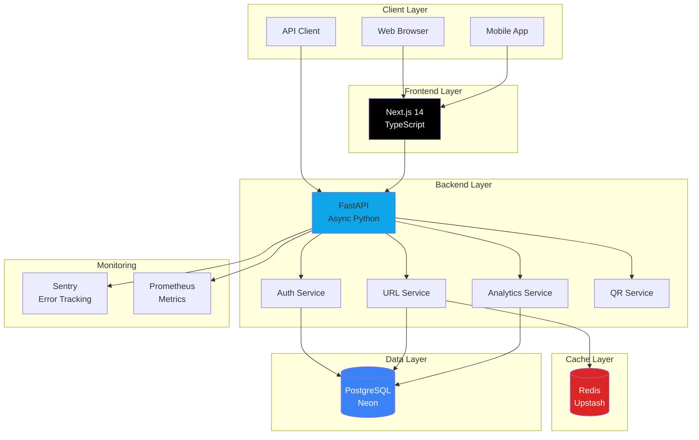
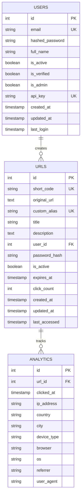
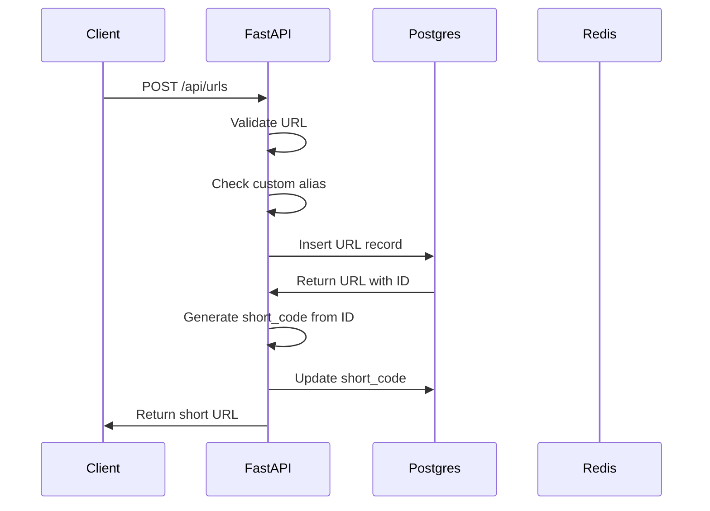
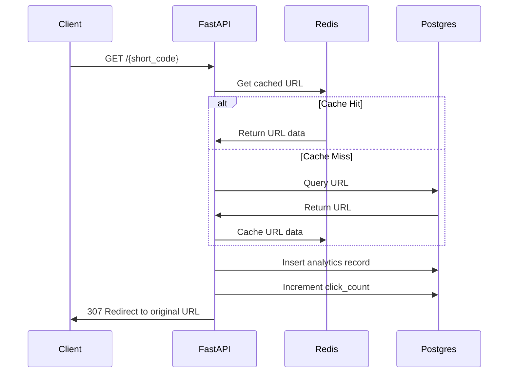
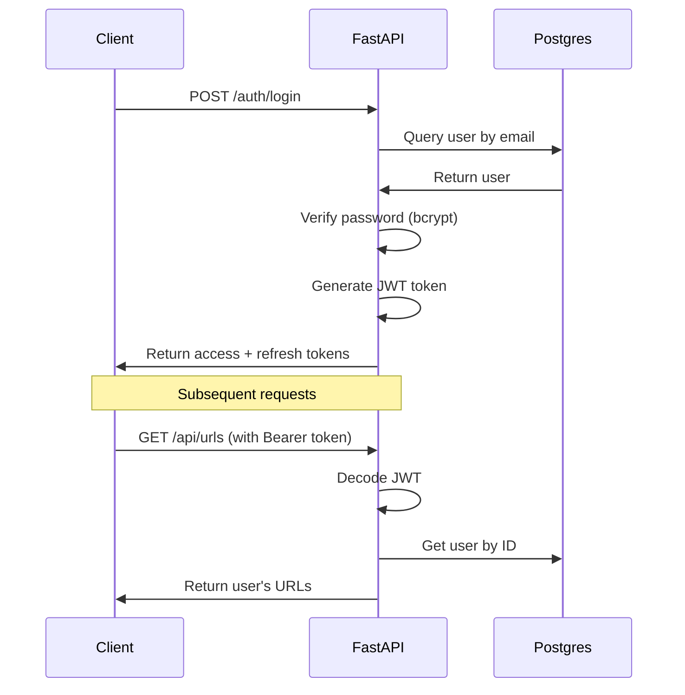

# System Architecture

## Overview

This URL shortener is built with a modern, scalable architecture designed to handle millions of URLs and billions of clicks. The system demonstrates production-ready patterns including caching, async I/O, proper indexing, and graceful degradation.

## High-Level Architecture



## Component Details

### Frontend (Next.js 14)

**Technology**: Next.js 14 with App Router, TypeScript, Tailwind CSS

**Responsibilities**:
- Server-side rendering for SEO
- Client-side interactivity
- Authentication state management
- Analytics visualization
- Responsive UI

**Key Features**:
- App Router for file-based routing
- Server Components for performance
- Client Components for interactivity
- Dark mode support
- Toast notifications

### Backend (FastAPI)

**Technology**: FastAPI with async/await, Python 3.11

**Responsibilities**:
- RESTful API endpoints
- Business logic
- Authentication & authorization
- Request validation
- Error handling

**Key Patterns**:
- Dependency injection
- Async database operations
- Middleware for cross-cutting concerns
- Pydantic schemas for validation

### Database (PostgreSQL)

**Technology**: PostgreSQL 15 with asyncpg driver

**Schema Design**:



**Indexes**:
- `users.email` (unique)
- `users.api_key` (unique)
- `urls.short_code` (unique)
- `urls.custom_alias` (unique)
- `urls.user_id`
- `urls.created_at`
- `urls.(user_id, created_at)` (composite)
- `analytics.url_id`
- `analytics.clicked_at`
- `analytics.(url_id, clicked_at)` (composite)

### Cache Layer (Redis)

**Technology**: Redis with async client

**Caching Strategy**:

1. **Hot URL Caching**
   - Key: `url:{short_code}`
   - Value: `{id, original_url}`
   - TTL: 1 hour
   - Invalidation: On URL update/delete

2. **Rate Limiting**
   - Key: `ratelimit:{ip}:{minute}`
   - Value: Request count
   - TTL: 60 seconds

3. **Analytics Aggregation** (future)
   - Key: `analytics:{url_id}:{date}`
   - Value: Click count
   - TTL: 5 minutes

**Graceful Degradation**:
- If Redis is unavailable, system continues to work
- Database is queried directly
- Performance degrades but functionality remains

## Data Flow

### URL Shortening Flow



### Redirect Flow (with Analytics)



## Security Architecture

### Authentication Flow



### Security Layers

1. **Transport Security**
   - HTTPS enforcement
   - Security headers (CSP, X-Frame-Options, etc.)

2. **Authentication**
   - JWT tokens (stateless)
   - API keys for programmatic access
   - Password hashing with bcrypt

3. **Authorization**
   - User can only access their own URLs
   - Admin role for system management

4. **Input Validation**
   - Pydantic schemas
   - URL validation
   - SQL injection prevention (parameterized queries)

5. **Rate Limiting**
   - Token bucket algorithm
   - Per-IP and per-API-key limits

## Scalability Strategy

### Current Capacity

- **URLs**: Millions (limited by database size)
- **Clicks**: Billions (with table partitioning)
- **Requests**: 1000+ RPS (with caching)

### Scaling to 100M+ URLs

#### 1. Database Sharding

```python
def get_shard(short_code: str) -> int:
    """Determine database shard based on short_code"""
    return hash(short_code) % NUM_SHARDS
```

**Sharding Strategy**:
- Shard by `short_code` hash
- 16 shards initially
- Each shard handles ~6M URLs

#### 2. Read Replicas

- Master for writes
- Multiple read replicas for analytics queries
- Connection pooling per replica

#### 3. Analytics Optimization

**Table Partitioning**:
```sql
CREATE TABLE analytics (
    ...
) PARTITION BY RANGE (clicked_at);

CREATE TABLE analytics_2026_01 PARTITION OF analytics
    FOR VALUES FROM ('2026-01-01') TO ('2026-02-01');
```

**Aggregation Tables**:
```sql
CREATE TABLE analytics_daily (
    url_id INT,
    date DATE,
    click_count INT,
    PRIMARY KEY (url_id, date)
);
```

#### 4. Caching Strategy

- **L1 Cache**: Application-level (in-memory)
- **L2 Cache**: Redis (distributed)
- **CDN**: CloudFlare for static assets and QR codes

#### 5. Async Processing

- Message queue (RabbitMQ/Redis) for analytics
- Background workers for aggregation
- Webhook notifications

## Monitoring & Observability

### Metrics (Prometheus)

- Request count by endpoint
- Request duration by endpoint
- Error rate
- Cache hit rate
- Database connection pool usage

### Logging

- Structured JSON logs
- Correlation IDs for request tracing
- Log levels per environment

### Error Tracking (Sentry)

- Automatic error capture
- Stack traces
- User context
- Environment tagging

### Health Checks

```http
GET /health
{
  "status": "healthy",
  "version": "1.0.0",
  "environment": "production",
  "database": "healthy",
  "cache": "healthy"
}
```

## Deployment Architecture

### Development

```
Docker Compose
├── PostgreSQL (local)
├── Redis (local)
├── Backend (hot reload)
└── Frontend (hot reload)
```

### Production

```
Frontend (Vercel)
    ↓ HTTPS
Backend (Railway)
    ↓
PostgreSQL (Neon)
Redis (Upstash)
```

## Technology Choices

### Why FastAPI?

- **Async support**: Native async/await for I/O operations
- **Performance**: One of the fastest Python frameworks
- **Type safety**: Pydantic integration
- **Auto docs**: OpenAPI/Swagger generation
- **Modern**: Python 3.11+ features

### Why PostgreSQL?

- **ACID compliance**: Data integrity
- **Complex queries**: Analytics aggregations
- **Indexes**: Fast lookups
- **JSON support**: Flexible schema when needed
- **Mature ecosystem**: Well-understood at scale

### Why Redis?

- **Speed**: In-memory cache
- **Data structures**: Counters, sets, sorted sets
- **TTL support**: Automatic expiration
- **Pub/Sub**: Real-time features (future)

### Why Next.js?

- **SSR**: SEO-friendly
- **App Router**: Modern routing
- **TypeScript**: Type safety
- **Performance**: Automatic optimization
- **Developer experience**: Hot reload, error overlay

## Future Enhancements

1. **WebSocket support** for real-time analytics
2. **Link bundles** (link-in-bio style)
3. **A/B testing** for URLs
4. **Scheduled links** (activate/deactivate)
5. **Webhook notifications** on clicks
6. **Browser extension** for quick shortening
7. **Mobile apps** (React Native)
8. **GraphQL API** for flexible queries
9. **Machine learning** for fraud detection
10. **Multi-region deployment** for global latency
